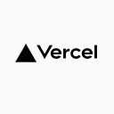

# HACKFEST 2022

.png)

## INTEGRANTES: 
- Pablo Isaac Garcia Orellana   1535-18
- Axel Cesar Rodas Samayoa      16008-18

## ENLACE DE REPOSITORIO

[ITZAMNA Github Repository](https://github.com/harvus1/education_webpage) 

## ACERCA DEL PROYECTO

Luego de analizar todos los objetivos que existen entre los objetivos de desarrollo sostenible 2030, pudimos descifrar que el que cumplía nuestros planes era el objetivo número 4, Educación de Calidad, ya que es uno de los objetivos mas importantes ya que sin educación no se puede cumplir los de mas objetivos, de la misma manera dentro de nuestra sociedad es uno de los pilares mas importantes para la evolución de nuestra sociedad ya que con la educación la ignorancia es atacada. 

### Forma de trabajo
El proyecto lo trabajamos atravez de llamadas en discord, el cual no fuimos distribuyendo por partes, Pablo se encargo principalmente de los estilos de css y sass, mientras que Axel se fue encargando de la estructura del HTML y la informacion que se utilizaria en la pagina web como las imagenes. en las charlas fuimos pensando en otras funcionalidades que le podria dar a la pagina para que fuera mas interativa con el usuario por lo cual desidimos crear una pagina de un juego y tambien una seccion
de bliblioteca virtual con libros de dominio publico. 

### Inconvenientes.
El principal inconveniente al crear la pagia fue el tiempo ya que teniamos otros proyectos y tareas asignados por lo cual se lo pudo dedicar poco tiempo a la creacion de la pagina, tuvimos muchas ideas y funciones que quisimos ir agragando pero por el timpo con el que disponiamos no ibamos a poder tratar de llevarlas a cabo porque nuestra pagina iba a queda incompleta. Pensamos que esta actividad fue planeada en mal tiempo de ciclo universitario ya que el interciclo es un pediodo muy corto cargado de muchas tareas.

### Publicacion del sitio web

La pagina fui publicada con vercel ya que es gratuito y facil de implentar, Vercel sirve para publicar paginas estaticas sin backend que no sean utilizadas comercialmente. 

## Aspectos positivos.
Principalmente que nos divetimos como equipo pensando que pagina subiriamos y que utilizariamos para eso, tambien fue una actividad de aprendizaje y practica al crear una pagina web, desde el desarrollo hasta el deploy, la actividad fue motivadora al ser una competencia no queriamos quedar conformes con que nuestra pagina quedara a medias ya que queriamos que fuera la mejor. 

## Aspectos que pueden cambiar en el hackfest.
Creemos que la actividad puede ser planificada con tiempo incluso abarcar un poco el periodo de las vacaciones, para que los estudiantes de puedan darle mas tiempo a la actividad y puedan crear mejores paginas web. 

